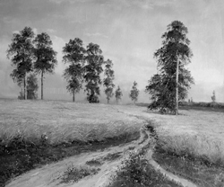
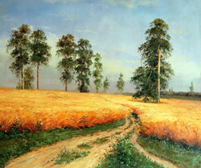
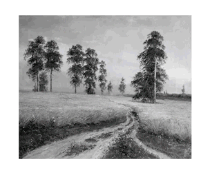
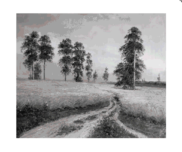

# canvas-hidden-images-viewer

**Canvas Hidden Image Viewer (CHIV)** -- is a lightweight library adds canvas to the page.
The background image is displayed on the canvas, while the hidden image is displayed only in the set radius of the cursor.

Just look at the example below:

| background image | hidden image | result |
| ------ | ------ | ------ |
|  |  |  |

Animation and rendering based on `setinterval` function. When the cursor leaves the canvas and the animation stops, all rendering stops.

# Usage

At first include file `src/chiv.js` (8kb) or `src/chiv.min.js` (4kb) on your page:

	

Then create `CanvasHiddenImagesViewer` object with some options:

	var imageViewer = new CanvasHiddenImagesViewer({
	    root: document.getElementById('root'),
	    radius: 100,
	    duration: 0.8,
	    backgroundImage: './images/image-black-white.jpg',
	    hiddenImages: [ { src: './images/image-color.jpg' }]
	});

# Options

| Option | Type | Description | Default |
| ------ | ------ | ------ | ------ |
| **root** | object (HTMLElement) | Root element in DOM for canvas | - |
| **backgroundImage** | string | Url or path to main (all-time visible) image | - |
| fps | number | Canvas redraws per second | 30 |
| cursorVisible | string (CSS property) | Type of cursor: [mozilla.org](https://developer.mozilla.org/ru/docs/Web/CSS/cursor) | "default" |
| radius | number | Cursor radius (in pixels) | 100 |
| duration | string | The time of appearance and reduction of the circle (in seconds) | 0.5 |
| easy | string | Timing function for circle animation. Available: "linear", "easeInQuad", "easeOutQuad", "easeInOutQuad", "easeInOutCubic", "easeOutElastic"| "easeInOutCubic" |
| hiddenImages | array | list of hidden images | - |

**option** - required option.

Options for hidden images:

| Option | Type | Description | Default |
| ------ | ------ | ------ | ------ |
| **src** | string | Url or path to hidden image | - |
| top | number | Position of the top side of the image relative to the canvas | 0 |
| left | number | Position of the left side of the image relative to the canvas | 0 |
| width | number | Width of the hidden image | current image`s width |
| height | number | Height of the hidden image | current image`s height |

# Example with multiple hidden images

| background image | hidden image | result |
| ------ | ------ | ------ |
|  |  |  |

	var marker1 = {
	    src: './images/marker.png',
	    top: 30,
	    left: 180
	}

	var marker2 = {
	    src: './images/marker.png',
	    top: 280,
	    left: 45,
	    width: 387
	}

	var imageViewer = new CanvasHiddenImagesViewer({
	    root: document.getElementById('root'),
	    fps: 30,
	    cursorVisible: 'pointer',
	    radius: 100,
	    easy: 'easeInOutCubic',
	    duration: 0.5,
	    backgroundImage: './images/image-black-white.jpg',
	    hiddenImages: [marker1, marker2]
	});

# MIT License

Copyright (c) 2020 izhurkov ([more details](LICENSE))